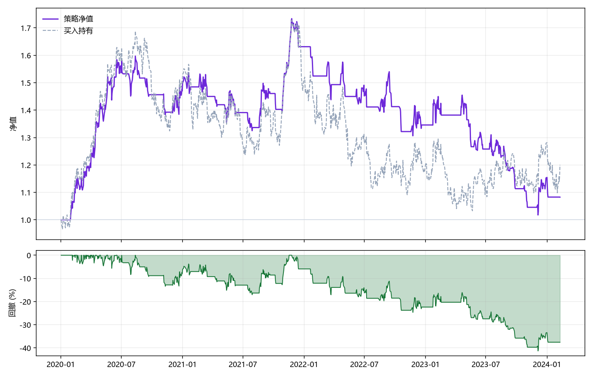

# 量化交易策略回测与研究工具

> 轻量级、可视化的回测引擎 · 从收益 / 风险 / 稳定性 / 成本多维诊断策略表现

<p align="left">
  
  
  
  
</p>

现有量化平台要么数据获取门槛高、要么策略封装过度（黑盒、无法调参）；开源框架学习曲线陡峭，
且普遍缺少对**月度稳定性**与**交易成本敏感性**的直观分析能力。

本项目提供一套轻量级、可视化的回测研究工具：支持用户灵活导入数据、自由调节策略参数，
并从**收益、风险、稳定性、成本**四个维度自动输出绩效评估报告，帮助研究者快速诊断策略表现、
定位参数优化方向。

---

## 目录

- [两种使用形态](#两种使用形态)
- [双图速览](#双图速览)
- [快速开始](#快速开始)
- [策略说明](#策略说明)
- [绩效指标](#绩效指标)
- [项目结构](#项目结构)
- [示例回测结果](#示例回测结果)
- [设计取舍](#设计取舍)
- [免责声明](#免责声明)

---

## 两种使用形态

| 形态 | 文件 | 适用场景 |
|---|---|---|
| **浏览器端可视化工具** | `quant-trading-tool.html` | 零依赖、双击即用；参数面板 + 实时图表，适合快速试参与演示 |
| **Python 回测引擎（库 + CLI）** | `backtest/` + `run_demo.py` | 可编程、可批量、可接入研究流程；支持自定义策略与导出图表 / CSV |

两套实现共用同一套指标口径（年化收益、最大回撤、夏普、卡玛、胜率、盈亏比等）。

---

## 双图速览



上图：策略净值 vs 买入持有基准；下图：回撤曲线（绿色为回撤区间）。

---

## 快速开始

### 方式一：浏览器直接用

```bash
# 直接双击打开，或在浏览器中打开
open quant-trading-tool.html       # macOS
start quant-trading-tool.html      # Windows
```

无需安装任何依赖，参数调节后即时重算。

### 方式二：Python 引擎

```bash
git clone <your-repo-url>
cd quant-backtest-tool
pip install -r requirements.txt

# 用内置示例行情（1072 个交易日，2020-01 ~ 2024-02）
python run_demo.py

# 用你自己的数据（CSV 需含 date / close 两列，也支持中文列名 日期 / 收盘）
python run_demo.py --csv data/688525.csv --strategy dual_ma --fast 5 --slow 20

# 换策略：RSI 超买超卖
python run_demo.py --strategy rsi --rsi-period 14 --rsi-oversold 30 --rsi-overbought 70

# 输出图表与交易明细
python run_demo.py --chart outputs/equity.png --trades-out outputs/trades.csv

# 调整交易成本（万三 = 0.0003）
python run_demo.py --fee 0.0003
```

作为库调用：

```python
import pandas as pd
from backtest import BacktestEngine, dual_ma_signals, trades_to_frame

prices = pd.read_csv("data/688525.csv", parse_dates=["date"], index_col="date")["close"]
signals = dual_ma_signals(prices, fast=5, slow=20)
result = BacktestEngine(fee_rate=0.0003).run(prices, signals)

print(result.summary())
print(trades_to_frame(result.trades).head())
```

自定义策略只需返回同索引的 0/1 目标仓位序列：

```python
def my_strategy(prices: pd.Series) -> pd.Series:
    return (prices > prices.rolling(60).mean()).astype(int)

result = BacktestEngine().run(prices, my_strategy(prices))
```

---

## 策略说明

| 策略 | 信号规则 | 可调参数 |
|---|---|---|
| **双均线** `dual_ma` | 快线上穿慢线建仓，下穿清仓 | `--fast`（默认 5）、`--slow`（默认 20） |
| **RSI** `rsi` | RSI 下穿超卖线建仓，上穿超买线清仓（带状态机保持仓位） | `--rsi-period`（14）、`--rsi-oversold`（30）、`--rsi-overbought`（70） |

约定：单标的、**仅做多、全额进出**，信号变化日按收盘价成交，买卖各计一次手续费。

---

## 绩效指标

引擎输出四类共 14 项指标：

- **收益**：累计收益、年化收益、基准（买入持有）收益
- **风险**：年化波动率、最大回撤、最大回撤区间、夏普比率、卡玛比率
- **稳定性**：月度收益分布、月度胜率、最好 / 最差月份
- **交易**：交易次数、胜率、平均盈利、平均亏损、盈亏比、持仓占比

成本敏感性可通过 `--fee` 反复回测对比（例如 `0` / `0.0003` / `0.001` 三档）。

---

## 项目结构

```
quant-backtest-tool/
├── quant-trading-tool.html        # 浏览器端可视化回测工具（单文件，零依赖）
├── backtest/
│   ├── __init__.py
│   ├── engine.py                  # 回测引擎：逐日模拟信号与成交 + 指标计算
│   └── strategies.py              # 双均线 / RSI 信号生成
├── run_demo.py                    # CLI：数据加载、回测、图表与明细导出
├── outputs/
│   ├── backtest_688525.py         # 真实标的（688525）回测脚本示例
│   ├── equity_dual_ma.png         # 示例回测图表
│   └── trades_dual_ma.csv         # 示例交易明细
├── requirements.txt
└── README.md
```

---

## 示例回测结果

内置示例行情（1072 个交易日，2020-01-02 ~ 2024-02-09，确定性随机种子）：

| 策略 | 累计收益 | 年化收益 | 基准 | 最大回撤 | 夏普 | 胜率 | 交易次数 |
|---|---|---|---|---|---|---|---|
| 双均线 (5/20) | 8.25% | 1.88% | 20.03% | −41.31% | 0.19 | 30.30% | 33 |
| RSI (14, 30/70) | 11.03% | 2.49% | 20.03% | −30.48% | 0.22 | 33.33% | 3 |

> 示例行情由确定性算法生成（`--seed` 可控），目的是**演示引擎与可视化**，
> 不代表任何真实标的的历史表现，也不构成投资建议。

---

## 设计取舍

| 取舍 | 选择 | 理由 |
|---|---|---|
| 用现成框架 vs 自研引擎 | **自研** | 逻辑完全可控可读，便于按研究需要插入自定义规则（如涨跌停、停牌处理） |
| 事件驱动 vs 逐日向量化 | **逐日循环** | 更直观、更易调试；1072 个交易日规模下性能完全够用 |
| 全功能平台 vs 单标的工具 | **单标的、仅做多** | 聚焦「快速验证策略假设」这一核心场景，避免过度设计 |
| HTML 工具 vs 纯 Python | **两者并存** | 演示与分享用 HTML；批量研究与入库用 Python |

---

## 免责声明

本项目仅用于量化研究与技术学习，所有回测结果均基于历史数据或示例数据，
**不构成任何投资建议**。历史表现不代表未来收益。
